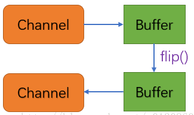

# 面向对象
```java
System.out.println("Hello World!");
```
# 泛型
# 函数式编程
# NIO
## 组成
- Channel 通道
  - FileChannel
  - SocketChannel
  - DatagramChannel
  - ServerSocketChannel
- Buffer 缓冲区
  - ByteBuffer
  - CharBuffer
  - DoubleBuffer
  - FloatBuffer
  - IntBuffer
  - LongBuffer
  - ShortBuffer
     
- Selector 选择器
  > Selector允许单线程处理多个 Channel。如果你的应用打开了多个连接（通道），但每个连接的流量都很低，使用Selector就会很方便。例如，在一个聊天服务器中。
  
**Channel 和 Buffer**

基本上，所有的 IO 在NIO 中都从一个Channel 开始。数据可以从Channel读到Buffer中，也可以从Buffer 写到Channel中。所有数据的读写都是通过Buffer进行的，永远不会出现直接向Channel写入数据的情况，或是直接从Channel读取数据的情况。Buffer的这种实现靠自带方法flip()。 图示：


**Buffer**
- flip()：将Buffer从写模式切换到读模式。
```java
public static void main(String[] args) {
    // 分配内存大小为10的缓存区
    IntBuffer buffer = IntBuffer.allocate(10);
    // 往buffer里写入数据
    for (int i = 0; i < 5; ++i) {
        int randomNumber = new SecureRandom().nextInt(20);
        buffer.put(randomNumber);
    }
    // 将Buffer从写模式切换到读模式（必须调用这个方法）
    buffer.flip();
    // 读取buffer里的数据
    while (buffer.hasRemaining()) {
        System.out.println(buffer.get());
    }
}
```
# 多线程
## 核心
- 内存屏障
为了阻止指令重排，打乱内存读、写操作指令执行顺序，造成混乱。
- volatile
修饰共享变量（未被final关键字修饰的静态或实例变量），保证其可见性和有序性，保障有序性和保障long/double型变量读
写操作的原子性。而又不会引发上下文切换。所以更像是轻量级锁。
- 阻塞队列 
- 原子变量类
- 关于锁：
>Java中的所有锁都是可重入的。内部锁（synchronized）仅支持非公平锁，因此它可
能导致饥饿。而显式锁（ReentrantLock）既支持非公平锁又支持公平锁，显式锁可能导
致锁泄漏。内部锁和显式锁各有所长，各有所短。读写锁（ReadWriteLock）由于其内部
实现的复杂性，仅适用于只读操作比更新操作要频繁得多且读线程持有锁的时间比较长的
场景。读写锁（ReadWriteLock）中的读锁和写锁是一个锁实例所充当的两个角色，并不
是两个独立的锁。
## 线程协作
### wait和notify
### Condition解决过早通知
### 倒计时协调器CountdownLatch
### 流量控制与信号量（Semaphore）
Thread.join()实现的是一个线程等待另外一个线程结束,有时候一个线程可能只需要等待其他线程
执行的特定操作结束即可，而不必等待这些线程终止。
### CyclicBarrier
CyclicBarrier用来实现这些工作者线程中的任意一个线程在执
行其操作前必须等待其他线程也准备就绪
## 并发队列 ✔️
### SynchronousQueue
SynchronousQueue 是 Java 中的一个阻塞队列，主要用于生产者-消费者模式，适合以下场景：
- 高效的任务交接：用于快速传递任务，比如在多线程环境中，生产者生成任务并立即交给消费者处理，避免了任务的缓存。
- 限制线程数量：可用于限制线程池中的工作线程数量，确保不会有多余的线程被创建。
- 流式处理：适合需要实时处理数据的场景，比如处理实时数据流，确保数据在生产和消费之间的实时性。
- 高并发场景：在高并发环境下，能够有效利用 CPU 资源，减少上下文切换的开销。

## 实战
- 分而治之
根据数据分割和根据任务分割
- 按步骤分割
- 大文件下载器
利用NIO，缓冲区
### 生产者消费者模式

# 新特性