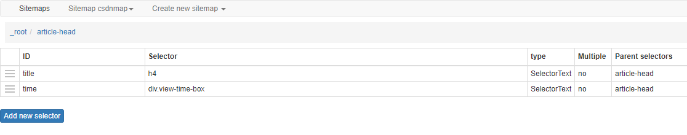

# web scraper

## 介绍
- sitemap 要爬取的站点地址
- selectors 要爬取的选择器列表
- 

## 案例
### 下拉加载更多
```json
{"_id":"csdnmap","startUrl":["https://blog.csdn.net/wandou9527/"],"selectors":[{"id":"title","parentSelectors":["article-head"],"type":"SelectorText","selector":"h4","multiple":false,"regex":""},{"id":"article-head","parentSelectors":["_root"],"type":"SelectorElementScroll","selector":".blog-list-box a","multiple":true,"delay":2000,"elementLimit":500},{"id":"time","parentSelectors":["article-head"],"type":"SelectorText","selector":"div.view-time-box","multiple":false,"regex":""}]}
```
### 分页数据
```json
{"_id":"douban-poet-page","startUrl":["https://www.douban.com/group/135641/discussion?start=[0-100:25]"],"selectors":[{"id":"container","parentSelectors":["_root","container"],"paginationType":"auto","type":"SelectorPagination","selector":"table.olt"},{"id":"title","parentSelectors":["container"],"type":"SelectorText","selector":"td.title","multiple":false,"regex":""},{"id":"author","parentSelectors":["container"],"type":"SelectorText","selector":"tr:nth-of-type(n+2) td:nth-of-type(2)","multiple":false,"regex":""},{"id":"reply","parentSelectors":["container"],"type":"SelectorText","selector":"tr:nth-of-type(n+2) td.r-count","multiple":false,"regex":""},{"id":"last_time","parentSelectors":["container"],"type":"SelectorText","selector":"td.time","multiple":false,"regex":""}]}
```
## 获取二级页面数据
web scraper 中提供了一种写法，可以设置页码范围及递增步长。写法是这样的： [开始值-结束值:步长]，举几个例子来说明一下：
1、获取前10页，步长为1的页面 ：[1-10] 或者 [1-10:1]
2、获取前10页，步长为10的页面：[1-100:10]
3、获取前10页，步长为25的页面：[1-250:25]
现在我们要抓取的豆瓣小组的规则就是第三中情况，所以设置 sitemap 的 Start URL 为：https://www.douban.com/group/135641/discussion?start=[0-100:25] 。

- b站：
```json
{"_id":"bilibili_rank","startUrl":["https://www.bilibili.com/ranking/all/1/0/3"],"selectors":[{"id":"container","type":"SelectorElement","parentSelectors":["_root"],"selector":"li.rank-item","multiple":true,"delay":0},{"id":"title","type":"SelectorText","parentSelectors":["container"],"selector":"a.title","multiple":false,"regex":"","delay":0},{"id":"author","type":"SelectorText","parentSelectors":["container"],"selector":"a span","multiple":false,"regex":"","delay":0},{"id":"play_amount","type":"SelectorText","parentSelectors":["container"],"selector":".detail > span:nth-of-type(1)","multiple":false,"regex":"","delay":0},{"id":"danmu_amount","type":"SelectorText","parentSelectors":["container"],"selector":"span:nth-of-type(2)","multiple":false,"regex":"","delay":0},{"id":"video_detail_link","type":"SelectorLink","parentSelectors":["container"],"selector":"a.title","multiple":false,"delay":0},{"id":"coin","type":"SelectorText","parentSelectors":["video_detail_link"],"selector":"span.coin","multiple":false,"regex":"","delay":0},{"id":"collect","type":"SelectorText","parentSelectors":["video_detail_link"],"selector":"span.collect","multiple":false,"regex":"","delay":0},{"id":"share","type":"SelectorText","parentSelectors":["video_detail_link"],"selector":"span.share","multiple":false,"regex":"[0-9]+","delay":0},{"id":"num","type":"SelectorText","parentSelectors":["container"],"selector":"div.num","multiple":false,"regex":"","delay":0},{"id":"like","type":"SelectorText","parentSelectors":["video_detail_link"],"selector":".ops span.like","multiple":false,"regex":"","delay":0}]}
```

# autojs
https://www.cnblogs.com/fengzheng/p/12880429.html